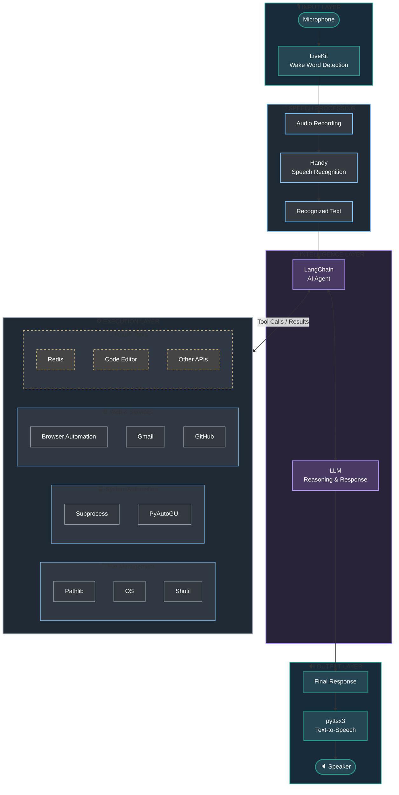

```mermaid

flowchart TB

    %% ================= INPUT =================
    subgraph INPUT["🎙️ INPUT LAYER"]
        direction LR
        MIC(["Microphone"])
        WAKE["LiveKit<br/>Wake Word Detection"]
        MIC --> WAKE
    end

    %% ================= SPEECH =================
    subgraph SPEECH["🧠 SPEECH PROCESSING"]
        direction LR
        REC["Audio Recording"]
        STT["Handy<br/>Speech Recognition"]
        TEXT["Recognized Text"]
        REC --> STT --> TEXT
    end

    %% ================= INTELLIGENCE =================
    subgraph BRAIN["🤖 INTELLIGENCE LAYER"]
        direction LR
        AGENT["LangChain<br/>AI Agent"]
        LLM["LLM<br/>Reasoning & Response"]
        AGENT <--> LLM
    end

    %% ================= TOOLS =================
    subgraph EXECUTION["⚙️ EXECUTION LAYER"]
        direction LR

        subgraph FILES["📁 File Management"]
            direction TB
            F1["Pathlib"]
            F2["OS"]
            F3["Shutil"]
        end

        subgraph SYSTEM["💻 System Automation"]
            direction TB
            S1["Subprocess"]
            S2["PyAutoGUI"]
        end

        subgraph SERVICES["🌐 Web & Services"]
            direction TB
            W1["Browser Automation"]
            W2["Gmail"]
            W3["GitHub"]
        end

        subgraph FUTURE["🚀 Future Tools"]
            direction TB
            X1["Redis"]
            X2["Code Editor"]
            X3["Other APIs"]
        end
    end

    %% ================= OUTPUT =================
    subgraph OUTPUT["🔊 OUTPUT LAYER"]
        direction LR
        RESPONSE["Final Response"]
        TTS["pyttsx3<br/>Text-to-Speech"]
        SPEAKER(["🔈 Speaker"])
        RESPONSE --> TTS --> SPEAKER
    end

    %% ================= CONNECTIONS =================
    WAKE --> REC
    TEXT --> AGENT

    AGENT <-->|"Tool Calls / Results"| EXECUTION
    LLM --> RESPONSE

    %% ================= STYLING =================
    classDef input fill:#264653,stroke:#2A9D8F,color:#FFFFFF,stroke-width:2px
    classDef speech fill:#343A40,stroke:#74C0FC,color:#FFFFFF,stroke-width:2px
    classDef brain fill:#493A63,stroke:#B197FC,color:#FFFFFF,stroke-width:2px
    classDef tools fill:#343A40,stroke:#ADB5BD,color:#FFFFFF,stroke-width:1px
    classDef output fill:#264653,stroke:#2A9D8F,color:#FFFFFF,stroke-width:2px
    classDef future fill:#454545,stroke:#FFD166,color:#FFFFFF,stroke-dasharray:5 5

    class MIC,WAKE input
    class REC,STT,TEXT speech
    class AGENT,LLM brain
    class F1,F2,F3,S1,S2,W1,W2,W3 tools
    class X1,X2,X3 future
    class RESPONSE,TTS,SPEAKER output

    style INPUT fill:#172B3A,stroke:#2A9D8F,stroke-width:2px
    style SPEECH fill:#202A35,stroke:#74C0FC,stroke-width:2px
    style BRAIN fill:#29233A,stroke:#B197FC,stroke-width:2px
    style EXECUTION fill:#202A35,stroke:#ADB5BD,stroke-width:2px
    style OUTPUT fill:#172B3A,stroke:#2A9D8F,stroke-width:2px
    style FILES fill:#303943,stroke:#74C0FC
    style SYSTEM fill:#303943,stroke:#74C0FC
    style SERVICES fill:#303943,stroke:#74C0FC
    style FUTURE fill:#303943,stroke:#FFD166,stroke-dasharray:5 5

```